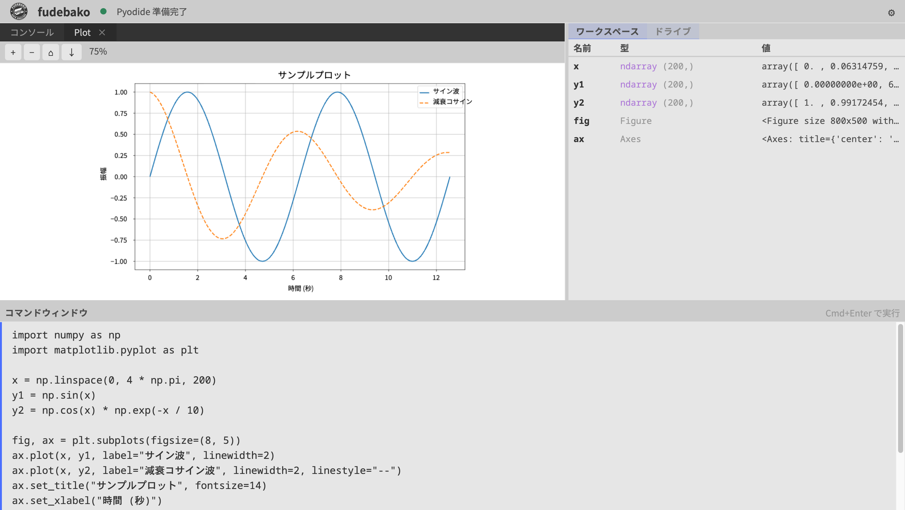

[日本語](README.md) | [English](README_EN.md)

# fudebako

ブラウザ内で動作する Python データ解析ツール。インストール不要、起動後はインターネット接続不要。ユーザーのデータはすべてブラウザ内で処理され、外部に送信されることはありません。

## すぐ試す

ダウンロードせずブラウザで試せます (lite 版):

**<https://jugoya-ai.github.io/fudebako/>**

ファイルのダウンロードが制限された環境やスマートフォンからも利用できます。`%pip install` や AI 関連ライブラリを使う場合、または最大の機能セットが必要な場合は、下記のダウンロード版をご利用ください。

## 特長

- **ローカル完結** — 起動後はネットワーク通信なし。外部通信が制限された環境でも使用可能
- **インストール不要** — 単一の HTML ファイルをダブルクリックするだけで起動
- **Python 搭載** — WebAssembly 上の Python 3.13 により、データ前処理・統計処理・可視化をブラウザ内で完結
- **グラフ描画** (`fudebako` / `fudebako-pygame`) — matplotlib による静的プロット、ズーム・パン・画像保存に対応。matplotlib はこの 2 エディションに同梱されています (`fudebako-lite` は Python 標準ライブラリのみのため対象外です)
- **永続ストレージ** — ブラウザ内に `/drive/` 領域を保持。作業途中の CSV やスクリプトを保存し、次回起動時に再開可能

## ダウンロード

[Releases ページ](https://github.com/jugoya-ai/fudebako/releases/latest) から、用途に応じて以下のいずれかを取得してください。

| エディション | ファイル | サイズ | 想定用途 |
|------------|---------|------|---------|
| **fudebako** (推奨) | `fudebako-vX.Y.Z.html` | 約 162 MB | AI 関連ライブラリを含む幅広い Python 用途。`%pip install` による PyPI からの追加インストールに対応 |
| **fudebako-lite** | `fudebako-lite-vX.Y.Z.html` | 約 39 MB | Python の標準ライブラリのみで完結する用途。最小サイズを優先する場合 |
| **fudebako-pygame** | `fudebako-pygame-vX.Y.Z.html` | 約 171 MB | **fudebako (推奨) のすべて** に加えて pygame-ce + SDL2 を同梱した上位エディション。AI ライブラリ + `%pip install` + キャンバス描画 (`Pygame` タブ) のすべてが利用可能。pygame-ce は LGPL-2.1 ライセンスを含みます |

迷ったら **fudebako** (推奨) を選んでください。`fudebako-lite` は payload を小さく抑えたい場合、`fudebako-pygame` は **fudebako の機能に加えてキャンバス描画も使いたい場合** の選択肢です。

各 Release には対応する `NOTICES.txt` (lite 版は `NOTICES-lite.txt`、pygame 版は `NOTICES-pygame.txt`) が添付されており、第三者ライセンスの全文を収録しています。

## 動作要件

| 項目 | 要件 |
|------|------|
| ブラウザ | Google Chrome 最新版 (推奨)。その他の Chromium ベースブラウザ (Microsoft Edge 等) でも動作しますが、公式サポート対象は Chrome のみです。Firefox / Safari は非対応 |
| メモリ | 2 GB 以上推奨 |
| ネットワーク | 起動時・実行時ともに不要 (※ `fudebako` で `%pip install` を使う場合のみ PyPI への通信が発生します) |

## 使い方

1. ダウンロードした HTML ファイルをダブルクリックし、既定のブラウザで開きます
2. 初回起動時は Python ランタイムの初期化に 20〜30 秒かかります。完了後「準備完了」と表示されます
3. 左側のエディタに Python コードを入力し、`Ctrl + Enter` (macOS: `⌘ + Enter`) で実行します

## 既知の制限

- Safari では、右ペイン (ワークスペース) の開閉に割り当てられたキーボードショートカット `Ctrl + Shift + W` (macOS: `⌘ + Shift + W`) が動作しない場合があります。Safari がこのキー組み合わせをウィンドウ操作として予約しているためです。右ペインはヘッダーのボタンからも開閉できます。

## ライセンス

- [**TERMS.md**](TERMS.md) — 利用規約 (日本語、正本)
- [**LICENSE**](LICENSE) — 英語参考訳 (齟齬がある場合は TERMS.md が優先)
- [**docs/THIRD_PARTY_LICENSES.md**](docs/THIRD_PARTY_LICENSES.md) — 同梱される第三者コンポーネントの一覧
- **NOTICES.txt** / **NOTICES-lite.txt** / **NOTICES-pygame.txt** — 各 Release に添付。第三者ライセンスの全文を収録

本ソフトウェアは「現状有姿 (AS IS)」で提供されます。詳細は [TERMS.md](TERMS.md) をご確認ください。

## お問い合わせ

- 不具合報告・機能要望: [Issues](https://github.com/jugoya-ai/fudebako/issues)
- 脆弱性報告: [SECURITY.md](SECURITY.md) を参照

---

Copyright © 2026 yonaka15. All rights reserved.
