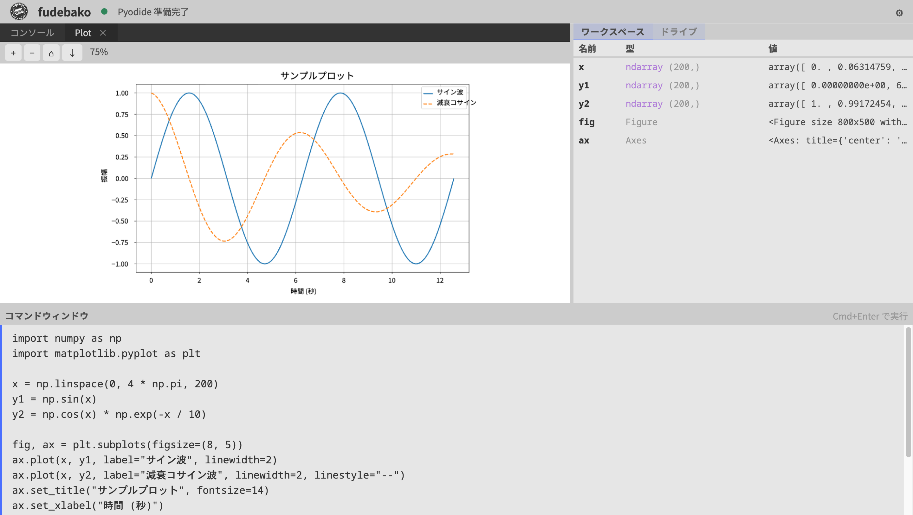

[日本語](README.md) | [English](README_EN.md)

# fudebako

A Python data analysis tool that runs entirely in your browser. No installation required, and no internet connection is needed after startup. All user data is processed within the browser and is never transmitted externally.

## Features

- **Fully local** — No network communication after startup. Usable in environments with restricted external access.
- **No installation** — Just double-click a single HTML file to launch.
- **Python included** — Python 3.13 on WebAssembly handles data preprocessing, statistics, and visualization entirely in the browser.
- **Plotting** — Static plots via matplotlib, with zoom, pan, and image-save support.
- **Persistent storage** — A `/drive/` area is preserved within the browser. CSVs and scripts in progress are saved and available on the next launch.

## Download

From the [Releases page](https://github.com/jugoya-ai/fudebako/releases/latest), choose one of the following based on your use case.

| Edition | File | Size | Intended use |
|---------|------|------|--------------|
| **fudebako** (recommended) | `fudebako-vX.Y.Z.html` | ~60 MB | Broad Python use including AI-related libraries. Supports installing additional packages from PyPI via `%pip install`. |
| **fudebako-lite** | `fudebako-lite-vX.Y.Z.html` | ~22.7 MB | For use cases that need only Python's standard library. Choose this when minimizing payload size matters most. |

If unsure, choose **fudebako** (recommended). `fudebako-lite` is the option when keeping the payload small is the priority.

Each release ships with a corresponding `NOTICES.txt` (or `NOTICES-lite.txt` for the lite edition) containing the full text of all third-party licenses.

## System requirements

| Item | Requirement |
|------|-------------|
| Browser | Latest Google Chrome / Microsoft Edge / Mozilla Firefox |
| Memory | 2 GB or more recommended |
| Network | Not required at startup or during execution (network access only occurs when using `%pip install` in `fudebako`) |

## Usage

1. Double-click the downloaded HTML file to open it in your default browser.
2. The first launch takes 20–30 seconds to initialize the Python runtime. When ready, "準備完了" (Ready) is displayed.
3. Enter Python code in the left editor and press `Ctrl + Enter` (macOS: `⌘ + Enter`) to execute.

## Known limitations

- On Safari, the keyboard shortcut `Ctrl + Shift + W` (macOS: `⌘ + Shift + W`) for toggling the right pane (Workspace) may not work, because Safari reserves this combination for window operations. The right pane can also be toggled via the button in the header.

## License

- [**TERMS.md**](TERMS.md) — Terms of use (Japanese, authoritative original)
- [**LICENSE**](LICENSE) — English reference translation (in case of discrepancy, TERMS.md prevails)
- [**docs/THIRD_PARTY_LICENSES.md**](docs/THIRD_PARTY_LICENSES.md) — List of bundled third-party components
- **NOTICES.txt** / **NOTICES-lite.txt** — Attached to each release; contains the full text of third-party licenses

This software is provided "AS IS." See [TERMS.md](TERMS.md) for details.

## Contact

- Bug reports / feature requests: [Issues](https://github.com/jugoya-ai/fudebako/issues)
- Vulnerability reports: see [SECURITY.md](SECURITY.md)

---

Copyright © 2026 yonaka15. All rights reserved.
