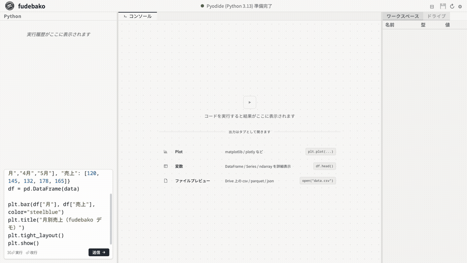
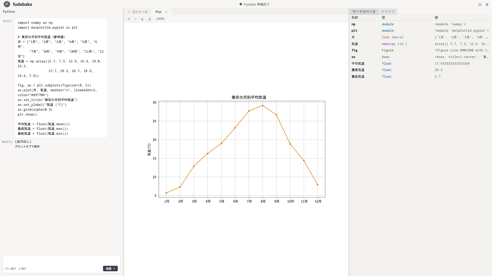

# fudebako プレスキット

fudebakoを動画や記事、SNSで紹介してくださる方向けの素材集です。
事前の連絡は不要ですので、自由にお使いください（CC0相当）。

---

## fudebakoとは

> **「閉じ込める」と「詰め込む」を兼ねた Python 環境。HTMLファイル1枚で動きます。**

名前の由来は「筆箱（ふでばこ）」です。2つの意味を込めています。

**閉じ込める筆箱** — 処理はすべてブラウザの中で完結し、外に出ません。入力したデータもコードもサーバーには送信されない。社外に見せられないデータでも、AIと一緒に使うときでも、安全に動かせる環境です。

**詰め込む筆箱** — pandas、openpyxl、matplotlib、scipy、OpenCV、pypdf、markitdownなど、業務でよく使うライブラリをHTMLファイル1枚に全部詰め込みました。ダウンロードしてダブルクリックするだけで、すぐ使えます。

- **公式サイト（ブラウザで試せます）**: https://jugoya-ai.github.io/fudebako/
- **ダウンロード**: https://github.com/jugoya-ai/fudebako/releases/latest
- **お問い合わせ**: support@jugoya.ai

---

## 素材一覧

### デモ動画・GIF

| ファイル | 尺 | 用途 |
|---|---|---|
| `demo/demo-screencast.gif` | 約40秒 | コード入力→グラフ出力のスクリーンキャスト |
| `demo/demo-short.mp4` | 約30秒 | ショート動画・サムネイル切り出し用 |
| `demo/demo-promo.mp4` | 約12秒 | ロゴ・タイトルカード用 |

※2分・5分の長尺デモは現在準備中です。お急ぎの方は support@jugoya.ai までご連絡ください。

### スクリーンショット

| ファイル | 内容 |
|---|---|
| `screenshots/screenshot.png` | fudebakoの全体画面（1920×1080） |

### ロゴ・ブランド素材

現在準備中です。必要な方は個別に対応しますので support@jugoya.ai まで。

### テキスト素材

| ファイル | 内容 |
|---|---|
| `intro-templates.md` | 動画の冒頭で使える紹介台本（30秒 / 2分 / 5分）|
| `qa.md` | コメント返しや動画内で使えるQ&A集 |
| `video-ideas.md` | 動画の企画ネタ・構成案 |

---

## 紹介時のお願い（任意）

- 公式URL（公式サイト または GitHub）を載せていただけると、視聴者の方がスムーズに試せるので助かります。
- 紹介していただいた動画や記事は、X（[@JugoyaAi](https://x.com/JugoyaAi)）でシェアさせていただくことがあります。
- 必須ではありませんが、コメントやDMで「動画にしたよ！」と教えていただけると、開発の励みになります。

---

## エディション早見表

用途に合わせて3つの版を用意しています。

| エディション | サイズ | 特徴・用途 |
|---|---|---|
| **fudebako**（推奨） | 約100MB | 主要なライブラリを網羅した全部入り版 |
| **fudebako-lite** | 約25MB | 標準ライブラリのみ。とにかく軽く動かしたい時用 |
| **fudebako-pygame** | 約105MB | 全部入り + pygame。ゲーム制作や可視化に |

どれを使うか迷ったら、まずは**fudebako**（推奨版）を選んでおけば間違いありません。
